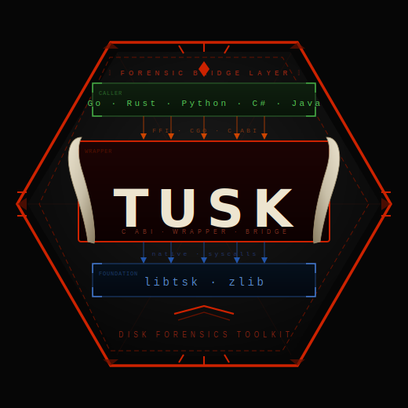
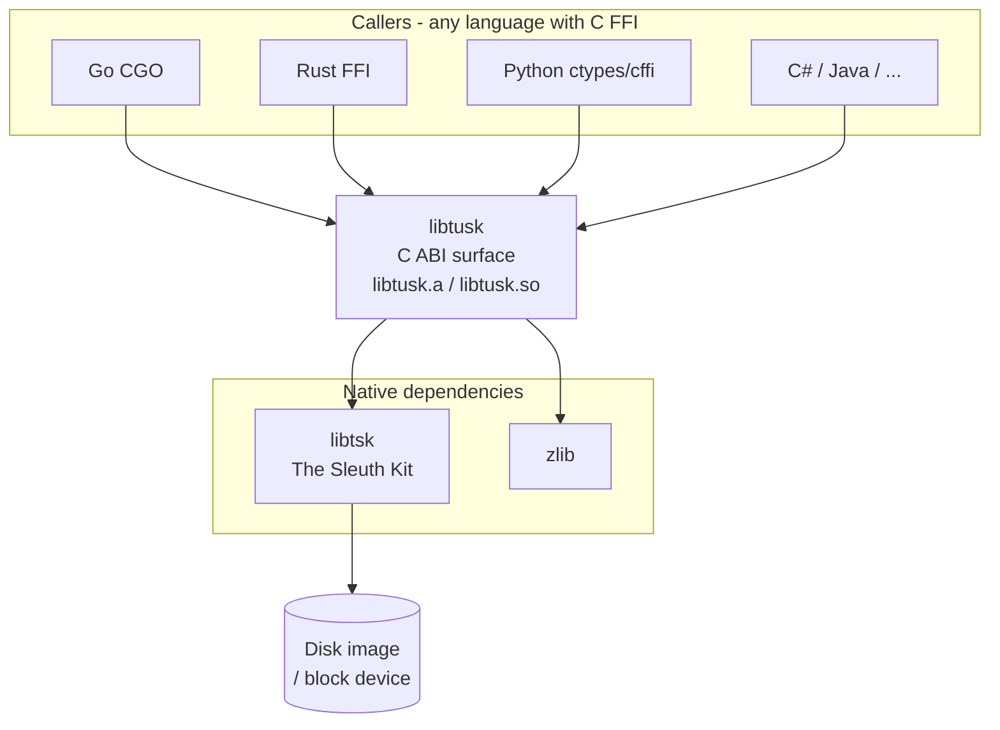
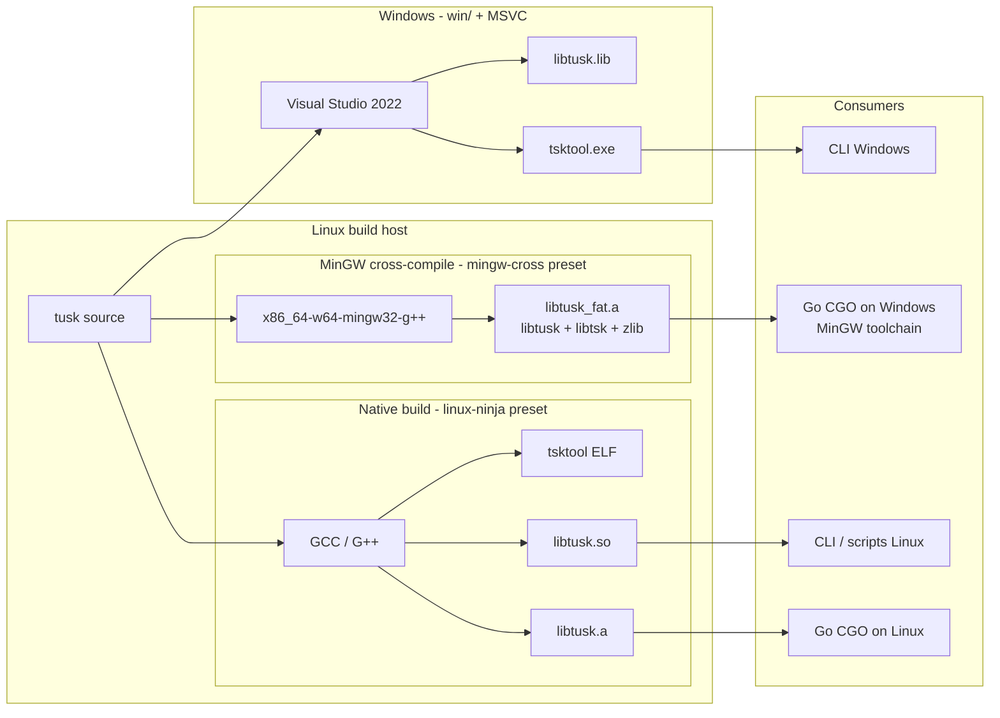
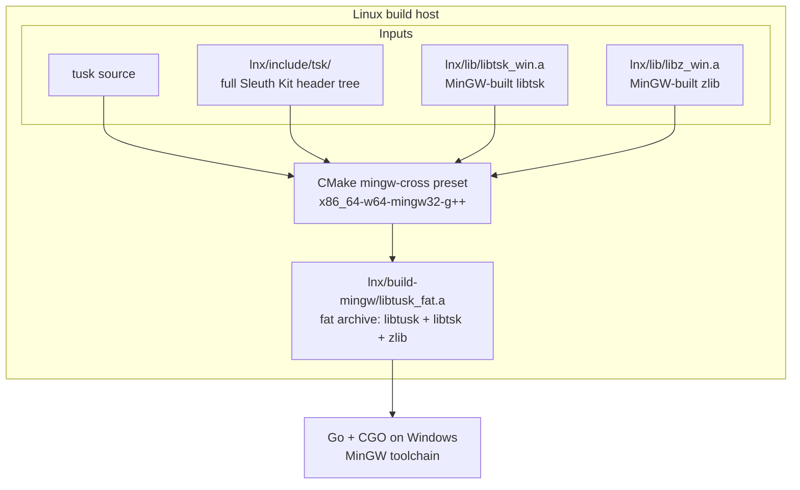

<div align="center">
  
</div>

# tusk

A **C ABI wrapper library and tool** around
[The Sleuth Kit (libtsk)](https://www.sleuthkit.org/) and zlib.

`tusk` bridges native disk-forensic power to any language that can speak **FFI,
CGO, or C bindings** — Go, Rust, Python, C#, Java, and beyond — without
requiring callers to deal with libtsk's raw C++ ABI directly. It exposes a
clean, stable C ABI surface (`libtusk`) that higher-level runtimes can load and
call without friction, while the bundled `tsktool` binary covers direct
command-line forensic workloads.

Two platform builds are provided:

| Directory | Platform | Build system               | Go / CGO compatibility                                                                                               |
| --------- | -------- | -------------------------- | -------------------------------------------------------------------------------------------------------------------- |
| `lnx/`    | Linux    | CMake + Ninja (or make)    | Full — static archive works natively on Linux; fat static archive enables CGO on Windows via MinGW cross-compilation |
| `win/`    | Windows  | CMake → Visual Studio 2022 | Limited — MSVC-generated library is not easily consumable as a Go CGO library; works well as a standalone `.exe`     |

---

## Architecture

### Component layers



### Build paths



---

## Linux (`lnx/`)

> **Go / CGO note:** The `lnx/` build has full Go CGO support on two fronts:
>
> - **Linux → Linux:** Use `lnx/build/libtusk_fat.a` — the fat static archive
>   that bundles libtusk, libtsk, and zlib into one fully self-contained file.
>   This is the recommended artifact for CGO; it requires no extra `-l` flags
>   and avoids version mismatches against system libraries. (`libtusk.a` is the
>   thin wrapper-only archive and is available if you prefer to manage
>   dependencies yourself.)
> - **Linux → Windows (cross-compilation):** Use `lnx/build-mingw/libtusk_fat.a`
>   — the MinGW fat archive that bundles all three libraries compiled with the
>   MinGW toolchain, ready for Go's CGO on Windows with no extra dependencies.
>   See
>   [Cross-compiling for Windows](#cross-compiling-for-windows-mingw-fat-archive)
>   below for full setup instructions.
>
> **In both cases `libtusk_fat.a` is the right choice for CGO** — it is a truly
> static, fully self-contained build.

### Prerequisites

```bash
sudo apt update
sudo apt install cmake build-essential libtsk-dev zlib1g-dev
# Recommended for faster builds:
sudo apt install ninja-build
```

Place static library archives in `lnx/lib/` before building:

```
lnx/lib/
    libtsk.a
    libz.a
```

Obtain the static archives by compiling libtsk/zlib from source or extracting
them from the dev packages (typically under `/usr/lib/x86_64-linux-gnu/`).

Sleuth Kit headers are expected in `lnx/include/` (or wherever `FOR_INC_DIR`
points in `lnx/CMakeLists.txt`). Adjust the variable if your layout differs.

### Build

Run the generate script — it handles everything (CMake configure + compile):

```bash
chmod +x lnx/generate.sh
./lnx/generate.sh
```

The script auto-detects Ninja and uses it when available, falling back to
`make`. Both run in parallel across all available CPU cores. If neither is found
it exits with a clear error.

To build manually without the script:

```bash
cd lnx
mkdir -p build && cd build
cmake ..
make -j$(nproc)
```

#### CMake build options

All options are `ON` by default and can be toggled at configure time:

| Option                 | Description                               |
| ---------------------- | ----------------------------------------- |
| `BUILD_WRAPPER`        | Build the libtusk wrapper library         |
| `BUILD_STATIC_WRAPPER` | Build `libtusk.a` static archive          |
| `BUILD_SHARED_WRAPPER` | Build `libtusk.so` shared library         |
| `BUILD_TOOL`           | Build the `tsktool` standalone ELF binary |

Example — static library and tool only:

```bash
cmake -DBUILD_SHARED_WRAPPER=OFF ..
```

### Outputs

| Output                                  | Description                                                         |
| --------------------------------------- | ------------------------------------------------------------------- |
| `lnx/build/libtusk.a`                   | Thin static library (libtusk wrapper only)                          |
| `lnx/build/libtusk_fat.a`               | Fat static archive (libtusk + libtsk + zlib — fully self-contained) |
| `lnx/build/libtusk.so` / `libtusk.so.1` | Shared library                                                      |
| `lnx/build/tsktool`                     | Fully static ELF (`-static -static-libgcc -static-libstdc++`)       |

### Test

```bash
gcc lnx/test_libtusk.c -o test_libtusk -I lnx/include -L lnx/build -ltusk -lpthread
./test_libtusk /path/to/disk.img
```

---

### Cross-compiling for Windows (MinGW fat archive)

The `mingw-cross` CMake preset cross-compiles libtusk for Windows from a Linux
host using the MinGW-w64 toolchain. The result is a **fat static archive**
(`libtusk_fat.a`) that bundles libtusk, libtsk, and zlib into one file, making
it directly consumable by Go's CGO toolchain on Windows (which uses MinGW under
the hood) without distributing any additional `.a` files alongside it.

#### Build flow



#### 1. Install MinGW-w64

```bash
sudo apt install mingw-w64
```

#### 2. Build zlib with MinGW

zlib must be compiled with the MinGW cross-compiler and placed at
`lnx/lib/libz_win.a`. The standard `libz.a` from `zlib1g-dev` is a native Linux
archive and cannot be linked by the MinGW toolchain.

```bash
wget https://zlib.net/zlib-1.3.1.tar.gz
tar xf zlib-1.3.1.tar.gz && cd zlib-1.3.1
CC=x86_64-w64-mingw32-gcc AR=x86_64-w64-mingw32-ar \
  RANLIB=x86_64-w64-mingw32-ranlib \
  ./configure --static --prefix=/tmp/mingw-sysroot
make -j$(nproc) && make install
cp /tmp/mingw-sysroot/lib/libz.a /path/to/tusk/lnx/lib/libz_win.a
```

#### 3. Build libtsk with MinGW

Similarly, libtsk must be compiled with MinGW and placed at
`lnx/lib/libtsk_win.a`. The native `libtsk.a` from `libtsk-dev` will not link
correctly with the MinGW toolchain.

```bash
# Inside the Sleuth Kit source directory:
./configure --host=x86_64-w64-mingw32 --disable-shared \
    CC=x86_64-w64-mingw32-gcc CXX=x86_64-w64-mingw32-g++ \
    --prefix=/tmp/mingw-sysroot
make -j$(nproc) && make install
cp /tmp/mingw-sysroot/lib/libtsk.a /path/to/tusk/lnx/lib/libtsk_win.a
```

#### 4. Copy the full `tsk/` header tree

MinGW compilation requires the **complete Sleuth Kit header tree** at build time
— not just the public headers installed by `libtsk-dev`. The `libtsk-dev`
package does not install every internal header that the cross-compilation build
requires. Copy the entire `tsk/` directory from the Sleuth Kit source tree into
`lnx/include/`:

```
sleuthkit/tsk/   →   lnx/include/tsk/
```

The `lnx/include/tsk/` subtree is already present in this repository — it was
copied verbatim from the Sleuth Kit source for exactly this reason.

#### 5. Build the fat archive

```bash
cd lnx
cmake --preset mingw-cross
cmake --build build-mingw
```

Output: `lnx/build-mingw/libtusk_fat.a` — a self-contained archive ready for Go
CGO on Windows.

---

## Windows (`win/`)

> **Visual Studio / Go note:** The `win/` project is built with MSVC (Visual
> Studio 2022) and is optimised for use as a **standalone executable**
> (`tsktool.exe`). Using the resulting `libtusk.lib` as a CGO library from Go on
> Windows is not straightforward due to ABI and linker incompatibilities between
> MSVC and the MinGW toolchain that Go's CGO relies on. If you need to call
> `libtusk` from Go on Windows, use the `lnx/` cross-compiled build instead (see
> below).

### Prerequisites

1. **Visual Studio 2022** with the _Desktop development with C++_ workload.
2. **CMake 3.16+** — bundled with Visual Studio or from
   [cmake.org](https://cmake.org/download/).
3. **Sleuth Kit headers** — set `TSK_INC` in `win/CMakeLists.txt` to point at
   your local copy.

Place pre-built static libraries in `win/lib/` before building:

```
win/lib/
    libtsk.lib
    zlib.lib
```

### Generate the Visual Studio solution

```powershell
cd win
.\generate.ps1
```

This creates `win/build/` if needed and runs `cmake --preset windows-vs2022`,
generating `win/build/tusk.sln` targeting x64.

To generate manually:

```powershell
cd win
mkdir build
cd build
cmake .. -G "Visual Studio 17 2022" -A x64
```

### Build in Visual Studio

1. Open `win/build/tusk.sln`.
2. Choose **Debug** or **Release**.
3. **Build → Build Solution** (`Ctrl+Shift+B`).

The MSVC runtime is set to **MultiThreaded** (`/MT`) — no CRT DLL dependency.

### Outputs

| Output                        | Description           |
| ----------------------------- | --------------------- |
| `win/build/Debug/libtusk.lib` | Static library        |
| `win/build/Debug/tsktool.exe` | Standalone executable |

### Test

```bat
cd win
cl test_libtusk.c /I include /I "%TSK_INC%" ^
    /link build\Debug\libtusk.lib lib\libtsk.lib lib\zlib.lib
test_libtusk.exe C:\path\to\disk.img
```

---

## Project layout

```
tusk/
├── lnx/
│   ├── CMakeLists.txt        # Linux build configuration
│   ├── CMakePresets.json     # Ninja + Unix Makefiles presets
│   ├── generate.sh           # One-shot configure + build script
│   ├── libtusk.cpp           # Library implementation
│   ├── tusk.cpp              # tsktool entry point
│   ├── test_libtusk.c        # Test harness
│   ├── LIBTUSK_ABI.md        # Public ABI documentation
│   ├── include/
│   │   └── libtusk.h         # Public header
│   └── lib/
│       ├── libtsk.a          # Static Sleuth Kit (pre-built)
│       └── libz.a            # Static zlib (pre-built)
└── win/
    ├── CMakeLists.txt        # Windows / MSVC build configuration
    ├── CMakePresets.json     # Visual Studio 2022 x64 preset
    ├── generate.ps1          # One-shot solution generation script
    ├── libtusk.cpp           # Library implementation
    ├── tusk.cpp              # tsktool entry point
    ├── test_libtusk.c        # Test harness
    ├── LIBTUSK_ABI.md        # Public ABI documentation
    ├── include/
    │   ├── libtusk.h         # Public header
    │   └── msvc_compat/
    │       └── inttypes.h    # MSVC compatibility shim
    └── lib/
        ├── libtsk.lib        # Static Sleuth Kit (pre-built)
        └── zlib.lib          # Static zlib (pre-built)
```

---

## Public ABI

See `LIBTUSK_ABI.md` in either platform directory for the full specification.

```c
// Analyze a disk image; returns a NUL-terminated JSON string on success, NULL on failure.
char *libtusk_analyze(const char *image_path);

// Release the string returned by libtusk_analyze. Do NOT use free() directly.
void libtusk_free(char *ptr);
```
